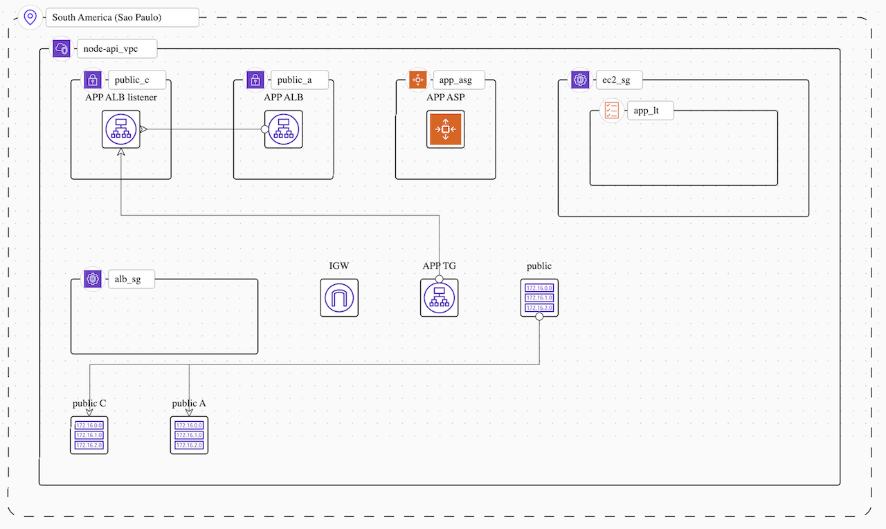

# Node API with Terraform

[](https://www.tidyverse.org/lifecycle/#experimental)

---

### Setup

Use the correct version of Node based on the `.nvmrc` file

```
nvm use
npm install
```
```
npm run dev
# 🚀 Server started: http://localhost:3001
```

## Deploy on AWS with Terraform
```
cd terraform
# Install Terraform provider
terraform init
```
```
# Preview the changes that Terraform plans to make in AWS
terraform plan
```
```
# Executes the actions proposed in a Terraform plan
terraform apply
```
```
# Destroy all the objects created by Terraform
terraform destroy
```

Diagram


### Deployment strategy

The following objects will be created by Terraform

- All objects will be created in `sa-east-1` AWS Region (São Paulo). 
- 1 VPC with 2 public subnets, each one in AZ `sa-east-1a` and `sa-east-1c`.
- 1 Internet Gateway (IG) and 1 Route Table associated with the subnets.
- 1 public Application Load Balancer (ALB):
  - Available in both AZ, `a` and `c`.
  - 1 Security Group (SG) with full egress and ingress HTTP port 80 (internet)
  - 1 Target Group (TG) listening port 3001 and checking `GET /health` with status code `200`
- 1 Launch Template for EC2 instances:
  - Created from the AMI `Amazon Linux 2023 AMI 2023.1.20230825.0 x86_64 HVM kernel-6.1 (ami-0358953f952e7ee66)`
  - Instance type `t2.micro` (**free tier**)
  - 1 root Elastic Block Storage for the EC2.
  - 1 `user_data` with [ec2-user-data.sh](./terraform/ec2-user-data.sh) script to bootstrap the Node API.
  - 1 Security Group (SG) with:
    - restricted http egress from the ALB and port 3001.
    - unrestricted SSH. 
    - full egress to internet.
- 1 Auto Scaling Group (ASG):
  - Min capacity of 1 and max capacity of 3 EC2 Instances.
  - Available in both AZ, `a` and `c`.
  - Associated with the same Target Group (TG) of the ALB.
  - Associated with the Launch Template for EC2 instances.
  - 1 Auto Scaling Policy of 25% `AverageCPUUtilization` of EC2.

For now, the way the Node API is implemented is by loading the script [ec2-user-data.sh](./terraform/ec2-user-data.sh) 
in the `user_data` of the Launch Template for the instances EC2.

The `user_data` will be executed when EC2 Instances start and therefore new source code
it will be downloaded from the GitHub repository and the Node API will start with the latest update.

## @TODO

- Create specific profile (aws user) to operate with Terraform.
- Create private subnets to deploy EC2 instances.
- Consider creating a NAT gateway.
- Implement GitHub Actions.
- Add logs to S3.
- Consider creating an alternative way of deploying using Docker and ECR with Fargate.
